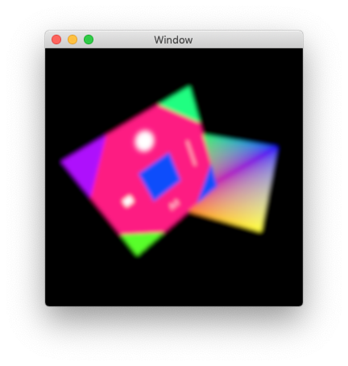

# Metal Post Processing Boilerplate

Boilerplate project for playing around with post processing effects like bloom, blur, noise, etc. in Metal.

Example using ping pong shading to apply a blur effect in multiple passes.

